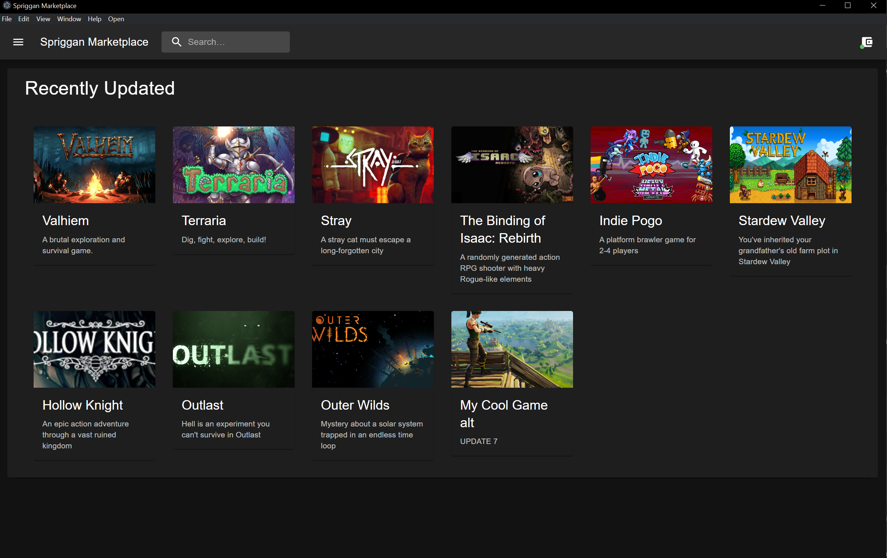
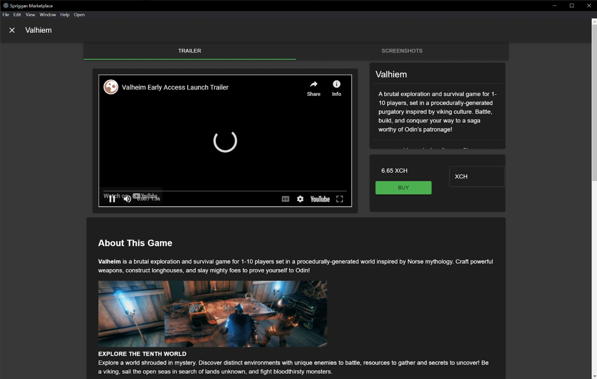

## What is Gosti?

Gosti is a collection of open source decentralized technologies and protocols brought together to form a truly free and open, censorship resistant platform where creators and publishers can sell and distribute their content globally without fear of corporate and social censorship, and without paying a percentage fee to anyone.

## Peer-to-Peer FTW

The Gosti network has been designed to be as Peer-to-Peer (P2P) as possible with centralized servers only being used where absolutely necessary or for optional, non-critical features. The core functionality of Gosti, being able to publish, distribute, sell, buy, download, and consume digital content, (primarily PC Games) using the open source Gosti Client is fully P2P and cannot be stopped by anyone, including us.

Gosti only uses centralized servers for filtering out spam/scams, ensuring uptime, and for additional features that require a centralized authority. That being said, all centralized parts of Gosti are open source and designed so that any person, or organization can, and should launch their own alternative servers that users can seamlessly switch between if they do not agree with our actions.


From the consumer side, Gosti works just like any other PC gaming platform. It allows gamers to browse a marketplace of games, buy them, install them, and play them. The only difference being that they would be buying games using cryptocurrency, and would own copies of their games as non-fungible tokens (NFTs).  **This does not require** use of a platform specific tokens that customers or publishers would have to buy. The "platform" does not touch transactions, all transactions happen directly between the game publisher and the customer. Publishers use our free and open-source tools to mint copies of their game and sell them directly on the open market using [offer files](https://www.chia.net/offers/). Games can be sold for any price set by the publisher, in any current or future token supported by the Chia blockchain including XCH, (Chia's native currency), wrapped bitcoin, wrapped Eth, and stable coins (tokens that are pegged to USD, or other fiat currencies).

## A New Second-hand Games Market

Using offer files, games are sold on the open market. This is not limited to the Gosti marketplace. Gosti marketplace actually currently uses the decentralized exchange (DEX) [Dexie](https://dexie.space/markets) for finding the best offers for the game you want to purchase. Customers will be able to choose to buy directly from the publisher, or to buy second hand if there is someone selling their copy for less.



Being NFTs, Gosti games are transferable and resalable. Publishers can set a percentage royalty to get back a slice of every resale. This will create an interesting secondary market where your game can find its own market price over time that you can control by limiting supply of new copies of your game. This is just one of the possibilities that Chia's flexibility can bring, but it is by no means necessary. It is possible to just set a high royalty, (as high as 100%) to prevent resale. Royalties are enforced on-chain on Chia. Eventually it will be possible to programmatically limit transfers to make resale impossible, but hasn't been implemented yet.

## What do the NFTs do?

Gosti NFTs are not like other NFTs you might have heard of. They simply represent ownership of a product, such as a game. They are not unique or collectable. They are not an investment, or a speculative asset and they do not represent equity, or anything other than a copy of the product that you bought. It is possible to create limited "Special Editions" and other gimmicks like that, but that is not the point of using NFTs for this.

When you have a Gosti game NFT in your wallet, you can cryptographically prove that you own that specific product in a way that can be publicly verified. This is used by the marketplace software to verify ownership for access to the torrent files for downloading, and passwords to decrypt game files without needing to deal with user authentication, and making all marketplaces interchangeable. It will also be possible to create plugins for common game engines to require verification of ownership to play a game, or premium parts of a game to prevent piracy. This is next on our list of projects to tackle after we launch.

## A Marketplace of Marketplaces

The most exciting feature of Gosti is its modular design. Gosti was built from the ground not as a marketplace, but as a framework for this type of marketplace. As of writing, Gosti is actually 3 different, independent applications running on this framework. The marketplace app, the library app, and the publishing app. The 4th application to be built will be the app store. This will be similar to the marketplace, but instead of games, it will allow users to install additional apps into Gosti. All of our code is open-source and available to everyone. We hope other developers will create their own apps for Gosti including alternatives to our built in apps, other marketplaces. Eventually, we want Gosti to expand into markets for other types of content like e-books, audio books, and more. Our apps are written in ReactJs and compiled to simple HTML and Javascript. Our hope is that we can build an ecosystem of developers to build out this project to make the front end for the real **Web 3**.

***

## How Does Gosti Make Money?

Well... it doesn't. Unlike traditional platforms, Gosti does not and cannot take any percentage cut from sales. However, being Peer-to-Peer, we will have very low operating expenses compared to traditional platforms. Until such a time that advertising and paid promotion makes sense, Gosti does not have a way to earn income. We also do not have any investors. Investors don't like the idea of not making money, and we refuse to take money from anyone who might compromise our vision for Gosti. So far, all development work has been donated by our only developer (me) over the past year+.

We are actively looking for people and organizations to sponsor the development of Gosti. We are in desperate need of funding. I'll spare you the gory details, but development of Gosti cannot continue at this rate without us bringing in at least a little bit of money as soon as possible. It would be amazing to have enough income from sponsors to consider hiring another developer or 2, but if we could just keep paying rent, that would be a huge weight off my chest.

Artistic freedom is incredibly important. If you think so too, please consider helping us out with our mission.

[Support Gosti](#support-gosti)

***

## Blog

### Our Upcoming Beta

We are preparing for a testnet beta. Gosti has a lot of moving pieces that still need to be tested, but all of the major features are functional. If you are a game developer/publisher and want to try out the system, please come to our [discord server](https://discord.gg/3C8cgfS6e9) and say hello. We are in need of testers, and we want to get as many games as possible onboard for the eventual mainnet launch. We also want to hear feedback, to know what your concerns are, and how we can improve.

***

### What Censorship are Creators Facing?

There are 2 types of censorship, and 2 types of censors. Let's call them hard, and soft censorship. And let's call the censors institutional, and social censors.

Hard censorship is the banning, or removal of a creator, or their content. Soft censorship is placing restrictions on creators in the form of "terms of service" and other content guidelines. This causes artists to self censor before before creating their work in the first place.

Institutional censors are conventional platforms, advertisers, payment processors, banks, governments, etc. Social censors are activist organizations, twitter mobs, etc that don't have direct control to hard censor, but by raising enough fuss, can force institutional censors to act.

You may think I am being a conspiracy theorist when I'm talking about governments and banks censoring content, but I'm not. Hard censorship is much more common than you probably think it is. There are [hundreds of instances](https://en.wikipedia.org/wiki/List_of_banned_video_games_by_country) of governments all around the world banning certain video games for all kinds of reasons. Often, it isn't the most extreme content that gets banned, it is only notable products that reach a large enough scale of outrage for governments to act. It is not unreasonable for artists to fear more general, wide spread censorship policies that make their work illegal in many countries including western countries that are relatively liberal. The most common cause of government bans (aside from the obvious violence and sexual content) are depicting gambling or drug use, LGBT themes, and political messaging. There isn't much that can be done about the laws of other countries, but through decentralization we can make it much harder for governments to ban content on a practical level. This is especially important when talking about content with political themes, and issues regarding human rights. Artistic freedom for this type of content is extremely important.

Recently, it has been is very common for financial institutions payment processors and banks to pressure platforms to censor sexualized content. Mastercard and Visa are the biggest players in this, they have a history of [going against pornographic content](https://www.cnn.com/2021/08/20/tech/onlyfans-explicit-content-ban-payment/index.html). But Paypal also has dipped it's toes into to censorship game by [seizing the funds](https://techraptor.net/gaming/news/lewd-idol-project-paypal-account-locked-kickstarter-funds) of several Patreon and Kickstarter projects with sexual themes. Regardless of how you feel about hardcore pornographic content, sexuality is a core part of the human experience and will always have a place in art. The right to create sexualized content needs to be protected.

Whether through pressure from payment processors, or of their own free will, many platforms large and small participate in censorship. Apple has made its [stance on sexualized content very clear](https://www.theverge.com/2021/5/7/22425759/epic-apple-trial-app-store-itch-io-offensive-sexualized-unspeakable-games-day-5), it is almost impossible to release content with a hint of sexuality on any apple device. Last year gaming platform GameJolt [banned all games with sexual content](https://www.kotaku.com.au/2022/01/game-jolt-bans-sex/). Recently there have been rumours that itch.io, one of the largest platforms for indie game developers [may cut off some of the payment options for games with sexual content](https://itch.io/t/2809361/will-adult-games-be-forced-into-direct-payments-instead-of-collected-by-itchio), likely due to pressure on the financial or legal side. Steam, by far the largest PC gaming platform allows sexual content, but cases still fall through the cracks. I myself was hard censored by Steam. I released a game that I thought followed their terms of service, but according to the person who reviewed my game, it did not. It wasn't sexual content that got my game banned, it was a perfectly normal PG-13 scene where 2 teenage characters kissed. This was deemed "sexual content involving a minor" and resulted in my game being completely removed from the platform. These "grey area" cases are common when you don't have clear lines drawn for what is, and isn't okay. Platforms leave their terms of service vague on purpose so that they can ban almost any content without being legally liable. It is not uncommon terms of service to include lines like "*Content with graphic depictions of violence or that promotes acts of violence will not be allowed.*" while obviously allowing and promoting violent content. Artists then have to guess as to what is and isn't allowed. The reality of this is, the platform can ban anyone they want without consequence.

As bad as hard censorship is, soft censorship is actually more harmful to artistic freedom. Every creator regardless of their medium and platform is constantly fighting against the terms of service and has to walk on eggshells to avoid having their sources of revenue cut off. If you look for it, you will see self censorship everywhere. Even on meaningless social media posts with no money at stake people still censor themselves when talking about topics like mental health, gender and sexuality, and political issues in fear of being censored by algorithms. These topics are incredibly important for people to talk about, and that censorship is extremely harmful.

Social censors have become a big deal in the past 5-10 years with the rise of social media. Being "canceled" is a big deal. Social censors absolutely have the ability to force institutional censors to act. There are many instances like the youtube "adpocalypse" where social censors forced advertisers to pull their funding, and on smaller scales having sponsors drop specific creators for. Ironically, it can be both good or bad to get canceled by a twitter mob. The attention that it brings can be very beneficial to creators, but can also be dangerous. Many artists, myself included like to hide our identity. When you create potentially controversial artwork it is almost guaranteed that you will be harassed by some group of people online. With doxing, there is solid chance of that harassment can carry over into the real world. The more that we can protect artists rights and give them tools to control their own privacy, the better.

***

## Why does Gosti use a Blockchain?

There is a very large stigma attached to blockchain, cryptocurrencies, and NFTs in the games industry. That skepticism is shared by not only the audience, but by creators as well. We understand that stigma more than anyone. It is important to note that Gosti is fundamentally different than other cryptocurrency projects that are responsible for that stigma. I would even argue that we aren't a crypto project. There is no token to buy, no speculation, it is just open source software that happens to use an existing blockchain for some of its functions. If you are a blockchain skeptic, I hope you can look past that for now and come to your own conclusion after looking deeper into this project.

Creators need a method of getting paid for their work. The choices are simple, there are 4 options.

* Direct payment via payment processors - Payment directly from consumer to creator through services like stripe or paypal. This is the logical option for direct fiat currency payments. Stripe charges a fee of 2.9% + 30¢ per transaction (paypal: 3.49% + 49¢). Additional fees may be added for international payments, or other factors. The list of possible censors include payment processors, banks, and governments. It also may require you set up a legal business and/or dox yourself to most if not all of those entities to receive payments.

* Collected by Organization - This is how most platforms like Steam and Epic Games Store work. The platform sells your content for you, handles their own payments, and pays you out monthly via a payment processor, or direct bank transfer. The organization then has complete control over your sales, and often charge a large fee (15-30%) for the privilege of reaching their audience. The list of possible censors is the platform, all payment processors supported by the platform, banks, and governments. It also may require you set up a legal business and/or dox yourself to most if not all of those entities to receive payments. This only makes sense for those platforms because they have a large established user base that they can leverage against creators. Given that this is the model that Gosti is trying to destroy, it is obviously not an option for us.

* Cash - Cash is great, it's very censorship resistant, but obviously not an option for the digital world.

* Cryptocurrencies - Proper usage of public blockchain allows for uncensorable and unstoppable payments. There are a lot of downsides to using crypto currencies. The biggest one being that very few people already use crypto currencies at all, much less for real transactions. Fees are another issue. They are a big unknown on the long term. The technology is still evolving, there are theoretically ways to scale to support huge numbers of transactions, very cheaply, but it's not sure when that technology will be practical. Fees are virtually 0 now, but there could be potentially be times where fees get out of control. In a sufficiently decentralized blockchain, it is almost impossible for anyone, including governments to censor transactions. It is still possible for governments to track transactions, which could still cause problems if drastic censorship laws get passed, but it is far superior

The choice to use a blockchain is a clear one. There is no way to create a truly free and open market without using a blockchain. It is not the easy path, but it is the right path.

***

## Which Blockchain does Gosti use?

The question of which blockchain to use is not simple, there are a lot of options. Some have come up with revolutionary tech, some are pale imitations of others, and some are complete garbage scams. It was a lot of work to sort through all of them and figure which are legitimate, legally compliant, have the right features, and are built by the most competent people. It may seem random that we have chosen to build Gosti on [Chia](https://www.chia.net/), a relatively new and unknown blockchain, but it is anything but random. Here are just some of the reasons why Chia was selected.

### True Peer to Peer Trading

Chia has a technology called offer files, which is something that does not exist on any other blockchain. Other blockchains claim to have “Decentralized Exchange”, but it’s all fake, backed by liquidity pools and smart contracts that are prone to hacks and scams. It’s hard to understand how revolutionary offer files are without experiencing them directly. Chia has true p2p trading that does not require an exchange, or any 3rd party. This is an offer file 👇

```
offer1qqr83wcuu2rykcmqvpsxygqqemhmlaekcenaz02ma6hs5w600dhjlvfjn477nkwz369h88kll73h37fefnwk3qqnz8s0lle02r6se8hn5rm8h3atz424u2jtpmhhj2ne7qjphjln3mmh2zwleexww6s99tvl4mhcmkrk2lm8eh44cxtu6tmk93q9fwj4k4mu9tmsttucjsmdrghuunlndpsh27tq5vyqahymnud90790aut5kd2uymnpu7pc7wd0tacwhmuuau9qhravm86f47l3fysmxaffzauq9fthdnecsj6unmut56hwccz7krqmlak0e3pv09nhlucfdr6rrshzpa5ucmm55ej8ffhyll5yejgsns5crf8dqh66hryz7l0mm78qme55adjdw7fdcacl8x0aq8mpzg4kuafml8zedxhelut3e64t8t8jrvdhhnzn2akhpuajmmsyv6a5j4uypu0045xxnq6vhkrtckp0w862j57qxysw537ukd66wd58n8v4t4cat20ww49juthntde0dg8df259tjy9cl50crrdztqw3lxv7zwe7qf8lqzskl88s7tlnpevk9enpk8hmwmcz2d0n42h94djvjfh20cvl33ejfclstjch5hlqa4rxjj2p292ma842d9a85mjp2xrx2mnwv4lyuljfkx54zktj098yyenfnxp8umnpdenyv4njtxn85ajxwx09nxtf5448yejpvf02y5teff38j6j7he9yjl5h5pzhsk23je9ehprjf9cc56zwg30mssaqw4yc0ru6w9u6hpnwhfshv7vjf6gmy6an5e5eaqdp4xcmadjptfgzrkwtrqx0g9nh6dj67yxuyrfvewlz56pva35m8xdg94uky754knrlufpvkl7llleku5p96kc8wf5953j2wen4k6d94pc5kjz32a2c2uzpjfv4y7zwplgerz8cuarlnzzfvujcne0ee8y2gfe839jkfkf89yugg2fw738yantk9tyj4t9ge0xl9vedwvclrj3g3feg4a2gxvc8zng2wz9j4ncfx5khvj3dxhcy4p46k5unurhg6jnpmgpjffsvujpt9gkvnj7d9mxvhn629c4vj2p5ec65k2fde3x552xtf9xnxdxv49yvnjf5xh9vjt7f92hjjvf5qzryyga2xfwaevsd3ffg80tnwvez6t8a7gxlcu7uns746nva9nx4yn9t30xqkys2ff94956nm3ey6hzpjut7dqq89k9y5srydmrs9st8qlcwjrhjrmh4et0e8tu9rnu4w3s5km3jyml4fkfpuhx03cytlcxezu3jzcke6x43d267nyqt3nev9ektkrd5kpa4lj74mwl0t32vtuu2at993gs7cffue0e0dull23y0vmuak8elxcm236lh4yethdavt57vpeau7h97txyh4amky2vlgmnsq5tjur5pec8gr5sspalar7wqyfpknl5nypcf9ragatml2juh79yzwjylhlgyyl8n48w2kmudkg6a79el9g9pvwa5ea756ssvkc8yr9d0van49ek82tnd6886tld8wgmkls2lkvwvde5cx8k0nvh53epu9r7gckfawym5nc6re2x6vus0fukp772rjytyfkx9uswwd0qepdvxanhp0vwqrvnxg87m2ae48z8tyffur20d25hlvv878pch90aquwj6v6m58nl7skq86k2y6l3tl4l5djtdukuuul9k0fmvxjkyqe27hll7qh3mwujtefk32dl79nmwvczcynlczekek2frkx5h23ee9l5m7xv5s806has78wdfurnnlujdkt7dv6y6v4eczmmae56jym5lenygxy5wmsv4lhjcp9mps6gvptkxzc8jpnzczrsw9csr2acteq9vpmepgz2jr5ugx8hmll0lqky5tpj2v5tmlmcvnn7rcjvehahdhqnemd27rwjm6az52h0a26ce25qrjaj8dfdwxnjsu04yvmjpemeal0fc0mphwjknjnj2649ut8v76aa08f24sh4nfyn9jekjdueeetw68980fmlzk0hje8n6vjjcfn456naflk0tnmmut3wx0uhculy4u3nm5t2ca08xx4v9awtclknllfvnxsxa0k9ak6wmqqsqxslrq4smrwmkh
```

You could copy and paste this into a Chia wallet to buy an NFT directly from my wallet to yours. I don’t have to know or care who you are and it’s completely secure. The only thing you can do with this offer is ignore it, or accept it and trade 1 XCH for my 1 shitty, worthless NFT.

That is how trading works under the hood on Chia, and how it cannot be censored. A common saying in Chia is that exchange is a verb, and not a noun. Using offer files, any means of communication, including this blog can be used to trade assets globally and completely trustlessly.

### Legal and Regulatory Compliance
Fraud is rampant in the cryptocurrency world. Chia was founded in 2017, and didn’t launch publicly until 2021. Chia could have launched a lot sooner, and made a lot more money if they didn’t do things the right way. Chia has worked with the SEC since the beginning and has not participated in the questionable, and illegal activity that other blockchain companies have been involved in. Chia has gone through the conventional process of raising funding and is preparing for an IPO when they will become the first blockchain company to go public.

Chia is the only blockchain company working directly with multiple governments through their partnership with the World Bank. This would not be possible without their legal compliance, which makes them the clear choice for building real blockchain applications that go beyond the crypto casino.

### Energy usage
Bitcoin, and any other blockchain that uses Proof-of-Work (PoW) consensus consumes way too much energy. That is obviously horrible for the environment. Chia’s Proof-of-Space-and-Time (PoST) consumes less than 0.1% of the energy as bitcoin, for equal or better security.


### Not Proof-of-Stake
Proof-of-Stake (PoS) is often touted as a solution to bitcoins energy usage, but PoS has huge security flaws that make PoS blockchains very centralized. The most important number when measuring a blockchains security is the Nakamoto Coefficient, which in simple terms, is the number of the largest entities that would have to collude to take control of the blockchain. Most blockchains (including bitcoin, and other top blockchains by market cap) have an estimated NC of < 10, some are as low as 2-3. Chia's NC is by far the highest at ~90 as of writing. Chia is by far the most decentralized blockchain in existence with over 100,000 nodes [all over the world](https://dashboard.chia.net/d/em15uQ47k/peer-info?orgId=1).

### Decentralized Identity and Verifiable Credentials
This is a very technical topic, that deserves it's own [blog post](#understanding-verifiable-credentials). On a basic level, these technologies will (in the future) allow for things like age gating content and region specific pricing. Verifiable credentials can be issued by a trusted authority so that a user can cryptographically prove that for instance, they are over 18, or are citizen of x country without needing to disclose all of their personal information to everyone that asks.

### A Good Team Behind it
Chia was founded by Bram Cohen, the inventor of the Bittorrent protocol. Bitcoin was inspired by and named after Bittorrent. Bram invented peer to peer technologies and is one of the most brilliant minds in computing. There is not a person on earth more qualified to design a public blockchain.

***

## Is Moderation without Censorship Possible?

This is a difficult question that many people have pondered for a long time. To have a successful marketplace for anything, moderation is necessary. Even if you intend to allow everything, even illegal or questionable content, you still have to protect users against spam and outright fraud to provide a good experience.

We designed Gosti with this problem in mind. What we did was limit moderation power to only what was absolutely necessary to moderate effectively and make everything else completely permissionless. The only part of Gosti that can be moderated is the back-end of the marketplace, a database that lists games that we have authenticated and have chosen to list on our marketplace. We have no control over payments or content distribution, just our own list of approved products. This allows us to provide a experience free of scams and garbage, while everyone, including scammers can always freely use the core of the system to try to sell their products which are completely compatible with the rest of the system.

We have made it as easy as possible for anyone else to create alternatives to our flagship marketplace, this is actually encouraged. Marketplaces in Gosti don't profit from sales, and don't censor, they simply verify and authenticate creators. Every product on Gosti is created equal with all of the same ability to sell and distribute copies, that power can't be taken away. By getting marketplaces to list your product, you gain more legitimacy and visibility. We want to create an environment where there are many of these marketplaces independently verifying and listing projects so that censorship gets more and more impossible. The reputations of their favorite marketplaces gives the customer confidence that they are buying legitimate products from legitimate creators. People and organizations we want to see running these marketplaces are for example, game developers/publishers, youtubers, media outlets, genre specific communities, etc. If you are interested in running your own marketplace on the Gosti network, please reach out!

In our opinion, this is what moderation without censorship looks like.

***

## How Gosti uses private DataLayer tables to authenticate and verify published content

Chia's [DataLayer](https://www.chia.net/datalayer/) is an amazing tool capable of creating public and auditable decentralized databases like the [Climate Action Data Trust](https://climateactiondata.org/). But it can also be used on a much smaller scale to authenticate and verify user data in a decentralized way.

Using our open source tools, creators can create and manage their own private DataLayer data store of products locally on their own system. This data is hashed and put on the blockchain. Using that publicly available hash, anyone can verify that data they have is authentic, while keeping the data private. Creators can be shared their product updates with trusted marketplaces to help distribute updates to everyone who owns a copy of their product. This private data includes torrent files and passwords to decrypt their content, which stay private between the creator, trusted marketplaces, and customers who have purchased the content.

Using this system simplifies publishing greatly because marketplaces do not have to care where their data came from, only that it is legitimate. User authentication is not necessary. When a marketplace receives an update for a product, or a request to list a new product, they only need to check that the hash of the data matches the hash on the blockchain to know that the update is legitimate.

## Understanding Verifiable Credentials

Verifiable credentials are a feature that is in the development pipeline of the Chia blockchain. It is not something that exists currently, but they are very important for Gosti long term.

# Support Gosti

You can support us on Patreon: [https://www.patreon.com/Gaerax](https://www.patreon.com/Gaerax)

Chia: ```xch1mnh5w6apdpq8v0atfw0e9rv9n3wyvgc90h9yczcdkuvfjzl8ej4s7530x3```

I have a paypal, but it's connected to my real identity, and I prefer to not dox myself publicly.

If you are a business, and want to sponsor Gosti, please reach out on Twitter, or email!

# Contact Us

We do not have official socials set up yet, but you can reach me directly Via any of these methods.

Email: [gaerax@gmail.com](gaerax@gmail.com)

Twitter: [twitter.com/Gaeraxx](https://twitter.com/Gaeraxx)

Discord: [discord.gg/3C8cgfS6e9](discord.gg/3C8cgfS6e9)